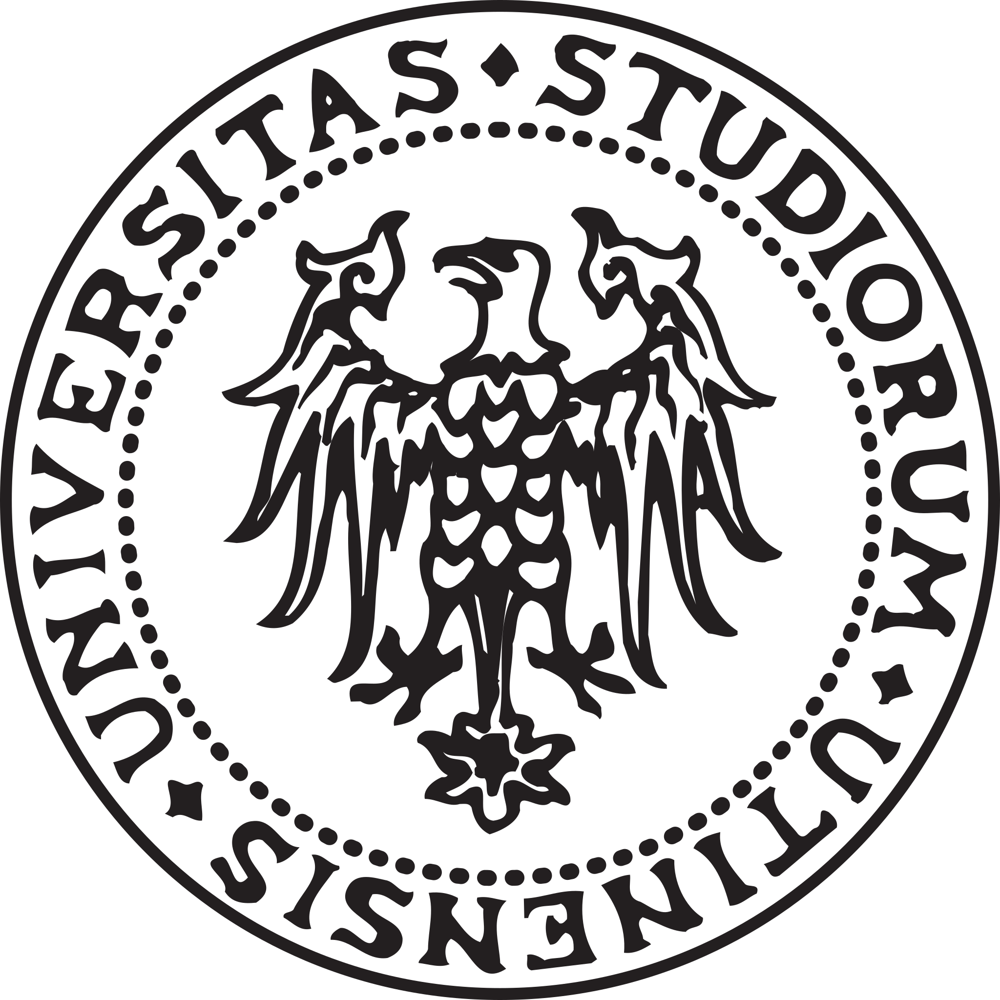
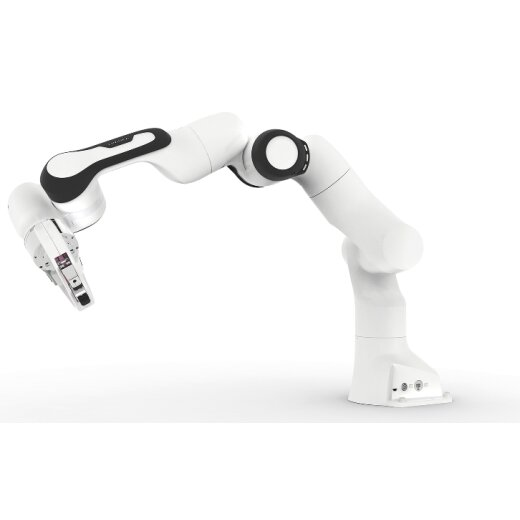

    

# Franka Emika workspace

This workspace contains all the packages used for tests and simulations regarding Franka Emika Panda Robot.

    

All the applications were developed by the University of Udine robotics laboratory, at the SMACT3 module of the LabVillage.

## Related work:
* [**Collision avoidance demo**](src/collision_avoidance/README.md)
* [**Minimum time-jerk trajectory tests**](src/path_planning/README.md)
